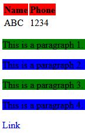

> Write an external stylesheet and link it with HTML code. The stylesheet should include following:
> 1. The web page will have the background image "img1.jpg".
> 2. The table heading will have red background color.
> 3. Background colors of alternate paragraphs are different.
> 4. The hyperlinks on the web page will not have underline.
***

#### style.css - external style sheet [8M]
```
/* The web page will have the background image "img1.jpg" */
body {
    background-image: url("img1.jpg");
}

/* The table heading will have red background color */
th {
    background-color: red;
}

/* Background colors of alternate paragraphs are different */
p:nth-of-type(odd) {
    background-color: green;
}

p:nth-of-type(even) {
    background-color: blue;
}

/* The hyperlinks on the web page will not have underline */
a {
    text-decoration: none;
}
```

### index.html - HTML code [2M]
```
<!DOCTYPE html>
<html>
<head>
<link rel="stylesheet" type="text/css" href="style.css">
</head>
<body>
    
<table>
    <tr>
        <th>Name</th>
        <th>Phone</th>
    </tr>
    <tr>
        <td>ABC</td>
        <td>1234</td>
    </tr>
</table>

<p>This is a paragraph 1.</p>
<p>This is a paragraph 2.</p>
<p>This is a paragraph 3.</p>
<p>This is a paragraph 4.</p>
<a href="#">Link</a>

</body>
</html> 
```

### output

