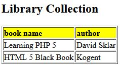

> Design a web page to maintain a Library Catalogue using XML. 
It should maintain the name of the book, author, publisher and year of the publishing. 
Format it into the tabular manner using XSLT. [10 M]
***
#### Library Catalogue using XML - library.xml [4M]
```
<?xml version="1.0" encoding="UTF-8"?>
<library>
  <book>
    <book_name>Learning PHP 5</book_name>
    <author>David Sklar</author>
    <publisher>O’Reilly</publisher>    
    <year>2014</year>
  </book>
  <book>
    <book_name>HTML 5 Black Book</book_name>
    <author>Kogent</author>
    <publisher>Kogent Learning solutions</publisher>    
    <year>2015</year>
  </book>
</library>
```

#### Format it into the tabular manner using XSLT - format.xsl [6M]
```
<?xml version="1.0" encoding="UTF-8"?>
<xsl:stylesheet version="1.0" xmlns:xsl="http://www.w3.org/1999/XSL/Transform">
<xsl:template match="/">
<html> 
<body>
  <h2>Library Collection</h2>
  <table border="1">
    <tr bgcolor="yellow">
      <th style="text-align:left">book name</th>
      <th style="text-align:left">author</th>
    </tr>
    <xsl:for-each select="library/book">
    <tr>
      <td><xsl:value-of select="book_name"/></td>
      <td><xsl:value-of select="author"/></td>
    </tr>
    </xsl:for-each>
  </table>
</body>
</html>
</xsl:template>
</xsl:stylesheet>
```

### output


***
Use: [XSLT Test Tool](https://xslttest.appspot.com/)
