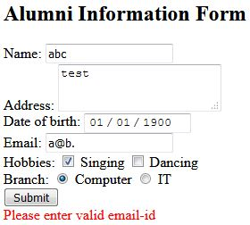

> Write code to process online Alumni infromation for your college. Create forms to get name, address, date of birth, 
and email id. Use check boxes for taking hobbies and rdio buttons for selecting branch. 
Write JavaScript code to validate the following: [10M]
> 1. User has filled all the fields prior to form submission
> 2. Validate email-id (with '@' and '.')
> 3. Age validation using DOB (>=22 years)
***
Marks distribution [5 + 3 + 2]
```
<!DOCTYPE html>
<html>
<head>
<title>Alumni Form</title>
</head>
<body>

<h2>Alumni Information Form</h2>
<form onsubmit="return validateForm()">    
    Name: <input type="text" id="aname" required><br>
    Address: <textarea id="address" required></textarea><br>
    Date of birth: <input type="date" id="dob" required><br>
    Email: <input type="text" id="email" required><br>
    Hobbies: 
    <input type="checkbox" id="sing"> Singing
    <input type="checkbox" id="dance"> Dancing <br>
    Branch: 
    <input type="radio" id="comp" name="branch" value="CS"> Computer
    <input type="radio" id="inft" name="branch" value="IT"> IT <br>
    <input type="submit" value="Submit">    
</form>
<div id="message" style="color: red;"></div>

<script>

function validateForm(){
    var message = document.getElementById("message");    
    var sing = document.getElementById("sing");
    var dance = document.getElementById("dance");
    var comp = document.getElementById("comp");
    var inft = document.getElementById("inft");
    var dob = new Date(document.getElementById("dob").value);    
    var email = document.getElementById("email");    
    message.innerHTML = "";

    if(!sing.checked && !dance.checked){
        message.innerHTML = "Please select at least one hobby.<br>";        
        return false;       
    }    

    if(!comp.checked && !inft.checked){
        message.innerHTML = "Please select branch.<br>";        
        return false;      
    }

    var today = new Date();
    var age = new Number((today-dob)/(365*24*60*60*1000)).toFixed(0);
    if(age < 22){
        message.innerHTML = "More than 22 years of age required.<br>";        
        return false;
    }

    if(!validEmail(email.value)){        
        message.innerHTML = "Please enter valid email-id";
        return false;
    }

    return false;
}

function validEmail(e) {    
    var atSymbol = e.indexOf("@");
    // check that atleast one character before @
    if(atSymbol < 1) return false;

    var dot = e.indexOf(".");
    // check that atleast one character between @ and .
    if(dot <= atSymbol + 1) return false;

    // check that the dot is not at the end
    if (dot == e.length - 1) return false;
    
    return true;
}

</script>    
</body>
</html> 
```
### output

